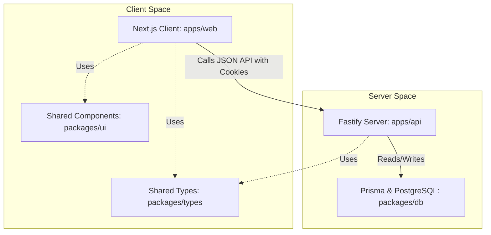

# Onusandhan AI - System Architecture

This document describes the architectural layout, authentication flows, database schema, and permission guards implemented inside the **Onusandhan AI** research portal monorepo.

---

## 1. System Topology

Onusandhan AI is built as a unified TypeScript full-stack monorepo:

---

## 2. Authentication & Authorization Flow

### User Session Life-Cycle
1. **Credentials verification**: User inputs email and password. Fastify hashes with `bcryptjs` and verifies.
2. **Token generation**: Fastify signs a JWT containing the user's details (`id`, `email`, `role`, `institutionId`).
3. **Storage**: The token is set as an `HttpOnly`, `SameSite=Lax`, secure cookie called `token`.
4. **Validation**: API routes use a Fastify hook (`fastify.authenticate`) that decrypts the cookie and checks user role permissions.

### Role Permission Guard Matrix

| Role | Submit Papers | Read Published Papers | Assign Reviewers | Submit Reviews | System Audit Logs |
| :--- | :---: | :---: | :---: | :---: | :---: |
| **Research Scholar** | Yes | Yes | No | No | No |
| **Author** | Yes | Yes | No | No | No |
| **Faculty / Researcher** | Yes | Yes | No | Yes (assigned only) | No |
| **Institution Admin** | No | Yes | No | No | No |
| **Platform Admin** | No | Yes | Yes | Yes | Yes |
| **Super Admin** | Yes | Yes | Yes | Yes | Yes |

---

## 3. Database Schema Models

We configure the following key relations in Prisma:
1. **User**: Credentials, profiles, locks, and roles.
2. **Profile**: Extended scholar credentials (university affiliation, specialization, bio, phone).
3. **Document**: Academic manuscripts with metadata (`fileSize`, `mimeType`), status (`SUBMITTED`, `UNDER_REVIEW`, `PEER_REVIEWED`, `ACCEPTED`, `REJECTED`), DOI, and category.
4. **DocumentCategory**: Enum tracking 12 document formats:
   - `THESIS`, `SYNOPSIS`, `PUBLICATION`, `CONFERENCE_PAPER`
   - `SIMILARITY_REPORT`, `AI_REPORT`, `MARKSHEET`
   - `WORKSHOP_CERTIFICATE`, `FDP_CERTIFICATE`, `IDENTITY_PROOF`, `SIGNATURE`, `OTHER`
5. **Review**: Peer evaluations, scores, comments, recommendations, and status (`PENDING`, `ACCEPTED`, `REJECTED`).
6. **ServiceRequest / ServiceWing**: Service requests for quantitative modeling, academic translation, and format desk.
7. **Course / CourseModule / Lesson / Enrollment / LessonProgress**: Classroom modules, lessons, and progress tracking.
8. **AIConversation / AIMessage**: Integrated AI chat sessions and message logs.
9. **SupportTicket / Notification**: User helpdesk queries and notifications.
10. **Payment**: Payment transaction references (`txRef`), amounts, and status.
11. **AuditLog**: Traceability records documenting uploads, deletion events, role modifications, and login attempts.

